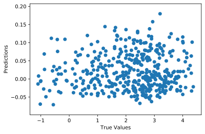
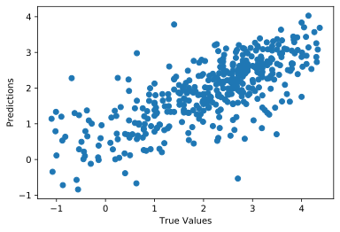

# logP prediction using SMILES strings and a CNN

Molecules can be represented in string form by a SMILES string. For example, the SMILES string of CO2 is `C(=O)=O` and the SMILES string of water is `O` (hydrogens are implicit). To use the strings as input for a CNN, each character is encoded as 1 x 52 vector. For an atom character (C, N, P, etc) the vector contains the type of atom in one hot encoded form, the number of bonds, charge, hybridization, chirality, and a few other things. When the character is a SMILES symbol ((, ), =, etc), it is one hot encoded (the first part of the vector, where the atom information would have gone, is blank). 

P is the partition coefficient between an organic and aqueous layer. Essentially, how much of a compound resides in the aqueous layer versus an organic layer (oil and water don't mix, compounds tend to prefer to hang out in either water or oil). logP is just the log of P. The logP value can help predict how a compound is absorbed by the body. The dataset is ~4000 experimental logP values from the [moleculenet lipophilicity dataset](http://moleculenet.ai/datasets-1).

The CNN was constructed using tensorflow's keras.

The idea and some of the code for encoding SMILES strings are adapted from [this paper](https://doi.org/10.1186/s12859-018-2523-5). 

# Current Results - a little better than random

Predictions with random weights, before training:

Loss = 6.01

Predictions after training for 100 epochs:

Loss = 0.74